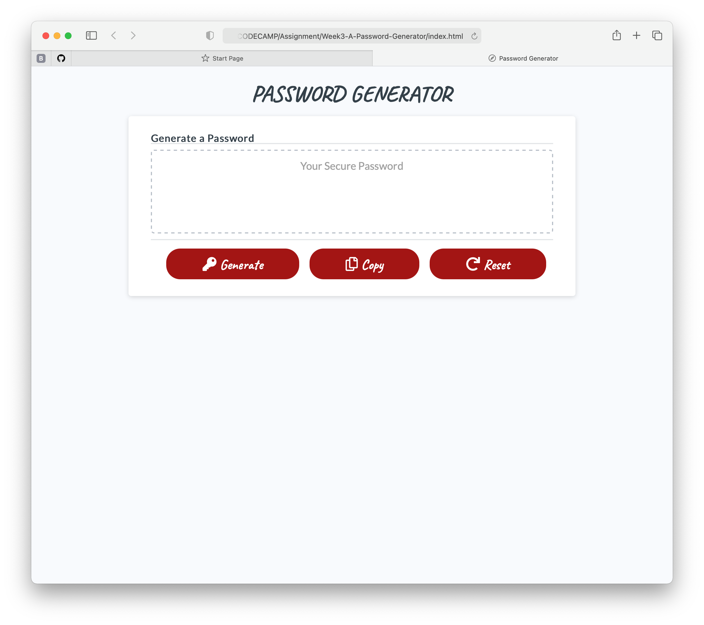
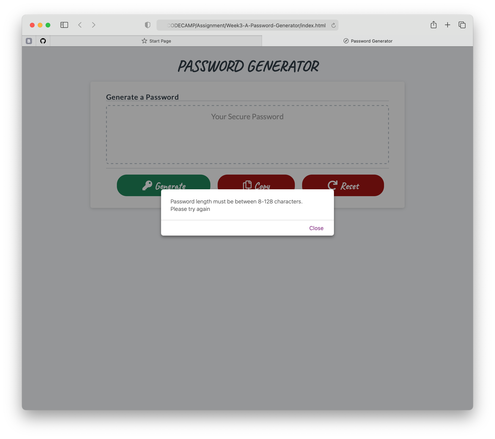

# Week3-A-Password-Generator
* Coding Bootcamp - Assignment - Week 3 - Password Generator

 

## Table of Contents
* [General Info](#general-info)
* [Live URL](#live-url)
* [Walkthrough](#walkthrough)
* [Webpage Preview](#webpage-preview)
* [Contributing](#contributing)
* [Notes](#notes)

 

## General Info
Modified the starter code to create an application that enables employees to generate random passwords based on criteria that they’ve selected.

The applicatation runs in any browser and adapts to multiple screen sizes. It features dynamically updated HTML and CSS powered by JavaScript code. 

 

### Live URL
https://joyofcodinglife.github.io/Week3-A-Password-Generator/

 

## Walkthrough
- When you click the button "Generate" to generate a password, then you are presented with a series of prompts for password criteria: 
  * first of all, you must choose a length of at least 8  characters and no more than 128 characters,
  * if your input is out of range, the app will ask again to choose the length,
  * then, you must select which characters' combination to   include in the password: lowercase, uppercase, numeric,    special characters,
  * if none selected, the app with ask to select at least one    character type,
- When all prompts are answered, then a password will be generated matching all the selected criteria.
- When you click the button "Copy", then the generated password is copied into ClipBoard for easy pasting.
- When you click the button "Reset", the page will refesh and erase all previous choices.
 

## Webpage Preview
The following images show the web application's appearance.

 

## Contributing
Pull requests are welcome. For major changes, please open an issue first to discuss what you would like to change, so I learn and understand it better.

Please make sure to update tests as appropriate.
 

## Notes
Quote that recently inspired me:

    "Lessons in life will be repeated until they are learned"

---
© 2021 L Korolyova